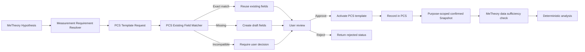

# MeTheory連携テンプレート要求

MeTheoryからの `pcs-integration-template-request-v1` は、仮説の検証に必要な観測項目を伝えるための契約です。PCSはsemantic roleを第一キーとして既存の確定済みフィールドを照合し、同じ意味でも値型・範囲・用途・公開設定が違う項目は自動統合しません。

不足項目だけをdraftに作成し、既存項目だけで満たせる場合は新テンプレートを作りません。結果は `exact_match`、`compatible_match`、`needs_user_confirmation`、`missing`、`incompatible` で記録されます。ユーザーのレビューで `approve` した後も、`activate` は別操作です。

要求は `source_system` と `source_request_id` の組み合わせで冪等化されます。PCSの状態取得は `GET /v1/integration-template-requests/:id` を使い、連携元がPCSのSQLiteを直接読むことはありません。

ダッシュボードの「連携」画面では、MeTheory要求の目的、再利用候補、追加項目、非互換項目を確認できます。承認、拒否、有効化は別操作として監査可能な状態に分けています。

## Decision and purpose safeguards

The matcher compares request purpose with active template purpose in addition to field semantics. A purpose mismatch is reported as `incompatible` and is never silently reused. Explicit candidate selection uses `POST /v1/integration-template-requests/:id/resolve` with `decision: "use_existing"`; rejection uses `decision: "reject"`. Both decisions are recorded before approval and activation.
